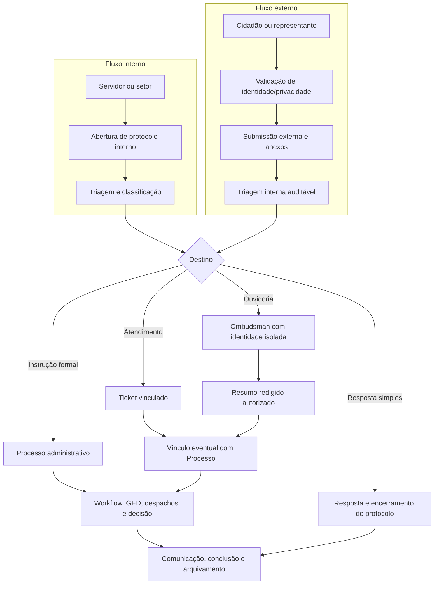

# CeleriFlow — Plano de Implementação de Processos e Protocolos

## POC Processos Eletrônicos Digitais — Rev. 01, 18/09/2026

**Natureza deste documento:** plano de execução e aceitação. Ele descreve o estado
levantado e o trabalho necessário; não declara que funcionalidades planejadas já
estejam entregues, homologadas ou em produção.

**Referência da POC:** `docs/POC/CeleriFlow_POC_Processos_Eletronicos_Digitais_Desenvolvimento_REV01.md`, revisão 01 de 18/09/2026, consultada na branch `main` do repositório. O catálogo contém PED-001 a PED-134. Todos permanecem com o estado **A_VERIFICAR** nesta revisão: o MD é especificação e roteiro de demonstração, não evidência de entrega. A matriz individual será fechada com cenário, evidência e aceite por ID.

## 1. Objetivo e resultado pretendido

Entregar uma plataforma de protocolo e processos administrativos que preserve a
base já existente, separe claramente a entrada da instrução formal, suporte
atendimento e ouvidoria com privacidade, e permita a abertura e o
acompanhamento externo depois de decisões institucionais de identidade e
exposição de dados.

O desenho alvo distingue quatro conceitos:

| Conceito | Papel no domínio alvo | Regra de separação |
|---|---|---|
| Protocolo de entrada | Registro inicial de uma solicitação, documento, manifestação ou comunicação recebida. | Tem número, canal, requerente, consentimentos, anexos e histórico próprios. Pode ou não gerar um Processo. |
| Processo administrativo | Autos formais que recebem instrução, tramitação, despacho, decisão e arquivamento. | Reaproveita o núcleo Process existente; não deve absorver sem filtro a narrativa sensível de um atendimento ou de uma ouvidoria. |
| Atendimento | Chamado operacional ao cidadão, servidor ou setor. | Continua com Ticket e seu histórico; quando a demanda exigir instrução formal, cria ou vincula um Protocolo/Processo com rastreabilidade. |
| Ouvidoria | Manifestação que pode ser anônima ou confidencial. | Mantém identidade e conteúdo protegidos em estruturas isoladas; conversão só transfere resumo autorizado e redigido. |

O trabalho não pressupõe que todo chamado, manifestação ou solicitação externa
vire processo. A triagem decide se haverá resposta direta, encaminhamento,
registro de ouvidoria ou abertura/vinculação de Processo.

## 2. Premissas verificadas do estado atual

### 2.1 Núcleo que pode ser reaproveitado

O módulo ativo de Processos/Protocolos já possui um núcleo relevante: Process,
ProcessType, Subject, ProcessMovement, ProcessDispatch, ProcessEvent,
documentos de processo e notificações. Há também workflow genérico versionado,
com definição, estágio, instância e evento, além de GED com Document,
DocumentVersion, DocumentClass e DocumentSignature. Esse núcleo deve ser
evoluído por extensões compatíveis, e não substituído por uma segunda máquina
de processos paralela.

O motor de workflow genérico já traz propriedades úteis: versão vinculada à
instância, histórico de eventos, transição sequencial, segregação de funções em
etapas, documentos obrigatórios, prazo com timezone e imutabilidade de versões
publicadas. A POC precisa provar, por cenário, quais dessas garantias atendem o
requisito e quais precisam de extensão para paralelismo, condições, delegação,
escalonamento, pausa de SLA, cancelamento, reabertura ou arquivamento motivado.

### 2.2 Atendimento e Ouvidoria

Atendimento trabalha com Ticket; Ouvidoria trabalha com Ombudsman. São domínios
distintos. A identidade da Ouvidoria já é isolada, possui concessões
excepcionais de acesso e auditoria. A conversão atual para Processo exige uma
descrição redigida e evita a cópia automática da identidade ou da narrativa
sensível. Essas duas garantias são requisitos de preservação: nenhuma migração
ou tela nova pode reduzir essa proteção.

### 2.3 Limitações que devem ser tratadas

1. A lista atual de Processos carrega um lote limitado e faz filtragem no
   cliente. A quantidade mostrada não representa necessariamente o total real
   encontrado no banco.
2. Há tabelas largas com rolagem horizontal e telas que usam rolagem global do
   documento no desktop, inadequadas para a meta de operação diária da POC.
3. Não existe portal público de protocolo: o atual “Portal do Cidadão” é um
   canal cadastrado, não uma superfície pública de abertura ou acompanhamento.
4. As identidades e a autenticação internas dependem de Firebase e de vínculo
   de servidor/setor. Esse modelo não atende, por si só, o cidadão externo.
5. Alguns estados são texto livre e já apresentam variações ortográficas. Sem
   estado canônico, filtros, SLA, relatórios e migrações não serão confiáveis.
6. O GED dos Processos é mais consistente que o upload de Atendimento. A nova
   entrada deve convergir para a cadeia versionada, com hash, classificação,
   auditoria e regra de acesso.
7. Permissões operacionais de Atendimento ainda têm inferências por nome de
   cargo. Elas precisam ser substituídas por permissões ou capacidades
   explícitas antes de ampliar o alcance do módulo.

## 3. Regra de interface e paginação da POC

A frase recebida sobre “sem rolagem e paginação” é ambígua e entra em conflito
com a POC, que exige paginação real de servidor para as caixas operacionais.
Para tornar o plano executável, a interpretação adotada é a seguinte:

- cada lista operacional exibirá **10 linhas por página**, salvo a última
  página;
- filtros, ordenação e paginação serão executados no servidor;
- o servidor retornará o conjunto da página e o **total real** compatível com
  os filtros aplicados; o total não será inferido pela quantidade já carregada;
- em desktop não haverá rolagem horizontal de tabela; a rolagem vertical normal
  da página só será restringida quando houver resolução homologada e critério de
  acessibilidade para isso;
- cabeçalho, filtros, ações e paginação serão apresentados sem região de
  rolagem aninhada na caixa operacional; a lista terá no máximo 10 registros e
  o detalhe documental terá leitura própria quando for necessário;
- campos secundários irão para detalhe, painel lateral, quebra controlada de
  texto ou cartões responsivos. Nenhuma coluna poderá forçar largura superior
  ao painel.

Essa interpretação deve ser confirmada com o responsável da POC no pacote P1.
Se a intenção for proibir também a rolagem vertical normal ou interna, o layout
deverá ser recalibrado por resolução homologada, sem alterar a regra de 10
linhas, paginação no servidor e total real.

## 4. Governança da POC e rastreabilidade PED

| Registro | Estado nesta revisão | Ação obrigatória antes de aceite |
|---|---|---|
| PED-001 a PED-134 | A_VERIFICAR | Registrar o texto oficial, prioridade, evidência esperada, responsável e pacote P1–P10 a partir do MD Rev. 01. |
| Evidência de requisito | Não produzida por este plano | Registrar cenário, dados de ensaio, ator, rota/API, resultado, data, revisão do banco e anexo de prova. |
| Aceite | Não iniciado | Somente mudar para VALIDADO depois de evidência reproduzível em desenvolvimento ou homologação. |

Os pacotes abaixo organizam a implementação. Eles não reclassificam
funcionalmente os PEDs nem convertem A_VERIFICAR em concluído. Durante o
refinamento, cada PED será ligado a exatamente um pacote principal e poderá ter
dependências em outros pacotes. Itens compartilhados terão uma única fonte de
verdade no registro de rastreabilidade.

## 5. Matriz atual versus POC — pacotes P1 a P10

| Pacote | PEDs e entrega-alvo da POC | Estado atual reutilizável | Lacuna e implementação planejada | Critério de saída e evidência |
|---|---|---|---|---|
| P1 — Cadastro e protocolização | 001–007, 011, 025, 043, 046, 053, 055, 065, 066, 080, 090. Tipo, espécie, assunto, interessado, prioridade, requisitos, comprovante, termo e numeração concorrente por ano/tipo/espécie. | `Process`, tipo, assunto e `ProcessSequence` existem; a abertura interna passa por serviço central. | Separar Protocolo de Entrada do Processo formal, incluir espécie, origem, palavras-chave, requisitos, numeração por escopo e comprovante/termo. | Persistência e busca no conjunto autorizado; validação no servidor, reenvio idempotente e número sem duplicidade. |
| P2 — Caixas e tramitação | 010, 014, 018, 031, 048, 050–052, 081, 088, 098–099. Caixas por setor/função/usuário/papel, recebimento, cancelamento, recusa, lote e trânsito entre órgãos. | `ProcessMovement`, eventos, notificações, recebimento e encaminhamento existem. | Concluir regras de participantes, destino por papel/função, integração entre órgãos e estados canônicos. Este incremento cobre recebimento em lote, cancelamento e recusa concorrentes de trâmite manual. | Uma única transição vence entre receber/cancelar/recusar; lote retorna resultado por item e cada ator/data/motivo é auditável. |
| P3 — Fluxos e formulários | 015–017, 023, 028–030, 057–065, 087, 089, 100–101. Formulários dinâmicos, condições, atividades, providências, prazos, subfluxos e atualização de instâncias. | Workflow genérico versionado, sequencial, com prazo e documentos obrigatórios. | Criar campos/respostas, regras condicionais, subfluxo, pausa/escalonamento e migração compatível de instâncias ativas. | Fluxo define próximo destino; formulário obrigatório bloqueia avanço; versão nova migra somente processos compatíveis sem apagar eventos. |
| P4 — Documentos e peças | 012–013, 024, 026–027, 037–038, 044–045, 047, 049, 056, 078, 084–085, 097, 102–106, 120. Peças, modelos, anexação, apensação, volume, foliação e composição. | GED, versões, hash, documentos de processo e assinatura interna existem. | Unificar anexos de Atendimento/Ouvidoria no GED, criar espécies, composição, ordem, volume, foliação concorrente, modelos e termos. | Arquivo real fica ligado à peça certa; ordem cronológica/foliação é concorrente e original assinado não é alterado. |
| P5 — Portal, sigilo e Ouvidoria | 032, 040–041, 067–074, 116. Portal externo, consulta controlada, sigilo, requerente, anonimato, ouvidoria, contestação e pedido documental. | Identidade de Ouvidoria isolada, grant, auditoria e conversão por resumo redigido existem; há aviso público redigido. | Fachada pública com submissão, token, consentimento, acesso limitado e triagem; políticas de identidade/sigilo precisam ser aprovadas. Este incremento centraliza a operação interna de Ouvidoria no card e expõe somente avisos já publicados no portal. | Cidadão vê somente dados autorizados; anônimo não requer CPF/nome/e-mail/login; token inválido não confirma existência. |
| P6 — E-mail e assinaturas | 008–009, 034–036, 039, 042, 082–083, 086, 092–096, 119. Comprovante, e-mail, auditoria, assinaturas, certificado, QR e terceiro signatário. | Notificação interna e assinatura por reautenticação Firebase existem; validação de aviso existe. | Implementar serviço de e-mail/fila, prova de entrega, adaptador ICP/externo, coassinatura e solicitação externa. | Duas assinaturas verificáveis no documento final; QR consulta versão correta e mensagem chega em caixa controlada. |
| P7 — Arquivo e cronograma | 019–022, 075–077, 079, 107. Conclusão, termo, guarda, arquivo, desarquivamento e cronograma. | Conclusão, arquivo/reabertura e alguns prazos existem. | Termos, localização física/lógica, tabela de temporalidade aprovada, cronograma e criação idempotente a partir de atividade. | Arquivamento/desarquivamento preserva o mesmo processo/histórico; guarda vencida não elimina documento automaticamente. |
| P8 — Digitalização, OCR e exportação | 108–115, 117–118, 121–127. Scanner, lote, OCR/neural, revisão, pesquisa, impressão e exportação. | Blob/GED pode receber anexos; não há captura/OCR real. | Integrar scanner, fila de captura, OCR com revisão bruto/confirmado, modelos de extração, pesquisa e exportador idempotente. | Imagem sem camada textual é capturada/OCRizada; revisão preserva bruto/confirmado e exportação não duplica registros. |
| P9 — URA | 033. Evento telefônico autenticado e idempotente que cria processo. | Nenhum receptor de URA ou contrato de telefonia. | Definir contrato de evento, autenticação, correlação e receptor idempotente separado do domínio. | Evento legítimo cria uma vez; replay não cria outro processo. |
| P10 — Gestão e modelagem | 054, 061–062, 091, 128–134. Dashboards, drill-down, mineração por eventos, diagramas, gargalos e procedimentos. | Painéis e relatórios iniciais existem; workflow tem eventos. | Indicadores no recorte inteiro autorizado, mineração baseada em eventos reais, documentação de fluxos e evidência operacional. | Gráfico e drill-down usam dados completos autorizados; variantes e tempos são calculados de eventos, não desenhados manualmente. |

## 6. Fluxo funcional alvo

### 6.1 Jornada interna

1. O usuário autenticado abre um Protocolo de Entrada e informa origem,
   interessado, assunto, classificação, descrição e anexos.
2. O servidor aplica regras de competência, número, prazo e visibilidade, e
   grava evento de criação.
3. A triagem recebe a entrada, define destino, responsável, prioridade e
   eventual exigência de complementação.
4. Quando for necessária instrução formal, a triagem cria ou vincula um
   Processo em transação lógica rastreável, sem apagar a entrada original.
5. O Processo tramita segundo workflow e permissões; cada recebimento,
   despacho, encaminhamento, decisão, documento e assinatura deixa evento.
6. O protocolo recebe comunicação limitada ao seu público e é encerrado,
   arquivado ou reaberto com motivo, sem eliminar o histórico.

### 6.2 Jornada externa

1. O cidadão escolhe o serviço e recebe explicação de finalidade, tratamento
   de dados, prazo e canais de retorno.
2. A fachada pública aplica decisão de identidade, consentimentos,
   rate-limit distribuído, Turnstile e política de anexos antes de persistir
   a submissão.
3. O portal gera identificador público e entrega token de acompanhamento uma
   única vez. No banco, guarda apenas hash do token e dados mínimos do
   requerente.
4. A triagem interna classifica o registro sem expor o cidadão como usuário
   interno; o ator técnico de recepção e o operador responsável ficam
   auditáveis.
5. O acompanhamento externo mostra somente eventos e respostas permitidos
   pela política do serviço. Documentos internos, dados de terceiros,
   despachos restritos e identidade de ouvidoria nunca aparecem.
6. Toda notificação externa é tratada como entrega assíncrona e idempotente;
   falha de e-mail ou mensageria não pode alterar o estado do protocolo.

## 7. Decisões institucionais e integrações

Nenhuma das decisões abaixo deve ser presumida pelo desenvolvimento. Elas
precisam de proprietário, fundamento normativo, público atendido e critério de
aceite antes de ativação em produção.

| Decisão ou integração | Alternativas e recomendação inicial | Pré-requisito | Ponto de implementação |
|---|---|---|---|
| Identidade no portal | Anônimo, CPF com OTP, conta cidadã ou combinação por tipo de serviço. Recomendação: começar por token de protocolo e exigir identidade apenas quando a natureza do serviço justificar. | Política jurídica e LGPD; prova de posse/representação quando exigida. | P5, com regras por serviço e sem reutilizar sessão de servidor. |
| Privacidade e exposição | Histórico privado por padrão; transparência somente em projeções redigidas, com campos permitidos por serviço. | Encarregado/LGPD, ouvidoria e área finalística. | P5, com classificação, mascaramento e retenção. |
| E-mail | Serviço SMTP ou transacional com fila, templates, opt-out e retorno de entrega. | Conta, domínio, credenciais, remetente institucional e política de comunicação. | P6; usar adaptador, tentativas idempotentes e log sem conteúdo sensível. |
| Turnstile | Cloudflare Turnstile antes de criar protocolo, subir anexo ou consultar repetidamente. | Chaves por ambiente, validação servidor e política de contingência. | P5; não confiar só em rate-limit de memória local. |
| Gov.br | Opcional para serviços que exigem identidade forte ou representação. | Contrato, escopo, homologação e base legal. | P5; isolar em provedor de identidade, sem tornar obrigatório para todos os serviços. |
| ICP-Brasil | Opcional quando assinatura externa com validade jurídica for requisito formal. | Definição do tipo de assinatura, provedor/adaptador, certificado e evidência jurídica. | P6; helper existente não representa integração concluída. |
| Scanner e OCR | Scanner para integridade de anexos; OCR em fila para extração auxiliar e revisão humana. | Motor, custo, classificação de dados, retenção e critério de erro. | P8; OCR não pode substituir validação documental nem expor arquivo a serviço não aprovado. |
| URA/canal assistido | Operador registra atendimento assistido, preserva canal e consentimento. | Integração de telefonia, roteiro, gravação/retenção e política de representação. | P9; a URA não escreve diretamente no banco de domínio. |
| Base de dados externa | Leitura por adaptador, mapeamento de finalidade e mínimo de dados. | Contrato, segurança, disponibilidade, LGPD e dono do dado. | P8; proibir acesso direto do portal à base externa e registrar consultas. |
| Notificações de prazo | Agendador de produção, fila e painel de falhas. | Responsável operacional e cron/worker configurado. | P6/P10; a rota existente de alertas internos não substitui agendamento produtivo. |

O aviso público já existente é uma projeção mínima e imutável, usada apenas
como leitura controlada. Nesta revisão, os avisos de `PROCESSOS` usam categoria
genérica para não revelar o tipo interno. O modelo atual não tem etapa formal de
aprovação, prazo de publicação ou revogação; por isso ele não pode ser tratado
como Diário Oficial, comunicação com efeito jurídico ou substituto do portal
externo. Esses controles exigem uma extensão aditiva antes de qualquer ativação
institucional ampla.

## 8. Arquitetura e modelo de dados propostos

### 8.1 Extensões aditivas

O modelo deve introduzir uma entidade de Protocolo de Entrada — nome final a
definir no dicionário — e suas relações. Campos mínimos esperados:

- identificador interno, número público quando aplicável, origem/canal,
  serviço, assunto, classificação, prioridade, estado e prazo;
- requerente, representante e interessado como papéis distintos, com
  minimização de dados pessoais;
- consentimentos e versão do aviso de privacidade aceita;
- vínculo opcional e auditável a Ticket, Ombudsman e Process;
- eventos próprios, mensagens visíveis ao requerente e mensagens internas
  separadas;
- token externo somente em hash, expiração, tentativas e revogação;
- documentos com classificação, versão, hash, status de análise e regra de
  visibilidade.

O Processo mantém o seu identificador e histórico. Não se deve renumerar autos
legados nem copiar estados de Ticket/Ombudsman para Process. Quando houver
vínculo, as entidades conservam suas regras de ciclo de vida e apresentam uma
referência cruzada autorizada.

### 8.2 Estados e eventos

Definir enumerações canônicas para protocolo e processo, com tabelas de motivos
de transição. A nomenclatura de apresentação pode ser localizada, mas a chave
persistida e a semântica do evento precisam ser estáveis. Uma proposta inicial
para o protocolo é RASCUNHO, RECEBIDO, EM_TRIAGEM, AGUARDANDO_COMPLEMENTACAO,
EM_ATENDIMENTO, FORMALIZADO_EM_PROCESSO, RESPONDIDO, CONCLUIDO, CANCELADO e
ARQUIVADO. A proposta só passa a valer após confronto com a POC e com os
estados legados.

Cada alteração deve registrar tipo de evento, estado anterior e posterior,
ator, competência, timestamp com timezone, motivo, correlação, origem e
referência de documento quando aplicável. Operações concorrentes de
recebimento, atribuição e decisão precisam de controle transacional ou
compare-and-swap para impedir dupla posse ou dupla decisão.

### 8.3 Autorização

A política deve ser avaliada no servidor para toda leitura e mutação. O escopo
de consulta deve combinar pelo menos: administrador autorizado, setor atual,
criador, interessado permitido, participante histórico, responsável anterior,
assinante, acompanhador e concessão excepcional. Dados de ouvidoria exigem
escopo adicional e não podem ser liberados pela simples participação em um
Processo vinculado.

## 9. Migração de dados com segurança

1. **Inventário antes de DDL.** Extrair contagens, estados distintos, vínculos,
   documentos, usuários, setores, identificadores duplicados e registros
   incompletos do banco real. A migration baseline não contém todo o DDL
   legado; o schema real precisa ser conferido antes de qualquer alteração
   estrutural.
2. **Somente migrations aditivas inicialmente.** Criar novas tabelas, colunas,
   índices e referências opcionais. Não remover campos, renomear estados em
   massa nem reciclar números de protocolo na primeira entrega.
3. **Tabela de mapeamento e backfill versionado.** Cada lote deve ter versão,
   cursor, data, contagem esperada, contagem gravada, falhas e possibilidade de
   retomada idempotente. Preservar chave legada e origem da transformação.
4. **Normalização controlada de estados.** Mapear valores como “Concluído” e
   “Concluido” para uma chave canônica sem apagar o valor original. Linhas
   ambíguas entram em fila de revisão, não em conversão silenciosa.
5. **Compatibilidade de leitura.** Enquanto telas legadas existirem, usar
   leitura compatível ou projeção de compatibilidade. Não redirecionar Ticket
   ou Ombudsman antes de validar histórico, relatórios e permissões.
6. **Privacidade de Ouvidoria.** Não fazer backfill automático de identidade,
   narrativa original ou anexos confidenciais para Processo/Protocolo. Usar
   somente resumo aprovado/redigido e vínculo protegido.
7. **Reconciliação e avanço.** Comparar total por entidade, amostra de
   identificadores, anexos, eventos e vínculos antes e depois. Corrigir com
   migration de avanço; evitar rollback destrutivo sobre dados novos.
8. **Cópia e recuperação.** Antes de aplicar no banco de produção, validar
   backup, janela, telemetria, plano de interrupção e responsáveis. Ensaiar em
   cópia representativa ou homologação, nunca com fixtures destrutivas no banco
   produtivo.
9. **Índices da participação histórica.** Antes de escalar a caixa que consulta
   tramitações anteriores, validar o plano de execução do Neon e criar índices
   aditivos alinhados ao escopo, no mínimo `(fromDepartmentId, processId)` e
   `(toDepartmentId, processId)` em `ProcessMovement`. O índice só será levado
   a produção depois da conferência do DDL real e da janela de migração.

## 10. Plano de execução sequenciado

| Etapa | Trabalho | Dependência | Resultado revisável |
|---|---|---|---|
| P0 — Preparação | Extrair a matriz PED do MD Rev. 01, inventariar o banco e registrar decisões de negócio. | Acesso de leitura ao ambiente e participação das áreas donas. | Backlog PED sem lacunas, dicionário inicial e registro de decisões. |
| P1/P2 | Cadastro/protocolização, numeração, caixas, recebimento, cancelamento, recusa e lote. | P0. | Jornada interna com regras de competência, transações seguras e auditoria. |
| P3/P4 | Fluxos/formulários e documentos/peças. | P1/P2. | Fluxo demonstrável, GED unificado, composição e requisitos documentais. |
| P5/P6 | Portal/sigilo/Ouvidoria, e-mail e assinaturas. | Políticas de identidade e privacidade, fornecedor quando aplicável. | Fachada externa segura, canais de comunicação e assinatura verificável. |
| P7/P10 | Arquivo, cronograma, gestão, indicadores e modelagem. | Fluxos e classificação documental aprovados. | Arquivo preservado, dashboards por eventos reais e procedimentos documentados. |
| P8/P9 | Scanner/OCR/exportação e URA. | Hardware, motor, contrato externo e ambiente de homologação. | Captura ou evento real, revisão humana e idempotência comprovada. |
| Homologação | Migração, carga, segurança, regressão e aceite dos 134 PEDs. | Todos os pacotes funcionais e ambiente de homologação. | Evidência por PED, reconciliação e checklist de produção. |

## 11. Qualidade, testes e evidências de aceite

### 11.1 Casos mínimos obrigatórios

| Área | Provas mínimas |
|---|---|
| Autorização | Criador, setor atual, participante histórico, gestor, ouvidoria e usuário sem permissão; leitura e mutação devem ser verificadas separadamente. |
| Privacidade | Anônimo, confidencial, representante, token expirado/revogado, tentativa de enumerar protocolo e tentativa de ler documento de terceiro. |
| Estados e workflow | Transição válida, inválida, concorrente, reabertura com motivo, documento obrigatório, segregação de funções e prazo. |
| GED | MIME/tamanho, hash, versão, download autorizado, exclusão lógica/retenção, antivírus e documento confidencial. |
| Listas e relatórios | Filtro no servidor, 10 registros por página, página final, total real, ordenação estável, campos longos e telas desktop sem rolagem horizontal; qualquer restrição vertical depende de resolução homologada. |
| Integrações | Sucesso, timeout, duplicidade, reenvio, indisponibilidade e ausência de vazamento no log. |
| Migração | Amostra de IDs, contagem por estado, anexos, vínculos Ticket/Ombudsman/Process, registros ambíguos e execução repetida do backfill. |
| Portal externo | Abertura, complementação, acompanhamento, comunicação, anexo, abuso, consentimento e isolamento entre dois cidadãos. |

### 11.2 Formato da evidência por PED

Cada item PED deve ter um registro com:

1. ID, texto oficial e pacote responsável;
2. pré-condições e massa de dados fictícia ou anonimizadas;
3. passos reproduzíveis, ator e perfil;
4. resultado esperado e resultado obtido;
5. referência a teste automatizado, rota/API ou consulta auditável;
6. captura de interface quando o requisito for visual;
7. data, ambiente, versão da aplicação e revisão de migration;
8. responsável pela execução e decisão de aceite.

Uma evidência de interface não substitui teste de autorização, e um teste
unitário não substitui ensaio de jornada. O status do PED muda de
A_VERIFICAR somente quando a evidência correspondente for revisada.

## 12. Critérios de pronto para produção

O módulo só estará apto a seguir para produção quando:

- a matriz PED-001 a PED-134 estiver preenchida e cada item aceito ou
  explicitamente excluído pela autoridade da POC;
- migrations aditivas, backfill e reconciliação tiverem sido ensaiados em
  ambiente representativo;
- não houver filtros ou paginação dependentes de dados carregados no cliente
  nas caixas previstas pela POC;
- as listas homologadas exibirem 10 linhas, total real e comportamento sem
  rolagem horizontal; qualquer restrição à rolagem vertical depende de resolução
  e acessibilidade homologadas;
- dados externos e de Ouvidoria estiverem protegidos por política de servidor,
  não apenas por ocultação visual;
- e-mail, Turnstile, Gov.br, ICP, OCR, URA e base externa estiverem desligados
  até possuírem decisão, credenciais, adaptador, testes e responsável
  operacional — ou estiverem formalmente fora do escopo;
- haja monitoramento de falhas, trilha de auditoria, plano de contingência e
  proprietário para prazos e notificações.

## 13. Riscos que exigem decisão antecipada

| Risco | Consequência se não for decidido | Dono sugerido |
|---|---|---|
| Identidade e anonimato externos | Implementação pode expor dado pessoal ou impedir o acesso legítimo. | Ouvidoria, jurídico/LGPD e área de atendimento. |
| Critério de divulgação pública | Portal pode transformar acompanhamento privado em transparência indevida. | Comunicação, jurídico/LGPD e controlador do serviço. |
| Regra de assinatura | “Assinatura” pode ser implementada sem validade jurídica requerida. | Jurídico e área documental. |
| Retenção de anexos/OCR | Custo, risco de vazamento e descarte irregular de documentos. | Arquivo, TI e LGPD. |
| DDL real e volume de dados | Migration pode falhar ou criar inconsistência em produção. | DBA/TI e responsável pelo banco. |
| Frase de layout ambígua | Homologação pode rejeitar uma rolagem vertical interna ou uma resolução não prevista. | Dono da POC e UX. |

## 14. Estado ao final desta revisão

Além deste plano, o incremento atual reforça o núcleo já existente sem migration destrutiva:

- a Caixa do Setor consulta, filtra e pagina no servidor, mostra total real, limita a página a 10 registros e usa tabela compacta/cartões responsivos sem rolagem horizontal;
- o recebimento em lote devolve resultado por processo; recebimento, cancelamento pelo setor de origem e recusa pelo setor de destino usam transição condicional para impedir dupla decisão concorrente;
- o escopo de leitura de Processos preserva a consulta do setor que participou do trâmite, enquanto mutações continuam verificando o setor atual no servidor;
- Ouvidoria ganhou entrada, listagem, detalhe e abertura interna dentro de Processos e Protocolos, preservando identidade isolada, grants, auditoria e a conversão somente por resumo autorizado;
- `/portal-protocolos` é uma superfície pública somente de leitura para avisos explicitamente publicados e redigidos; a abertura externa não foi simulada e permanece bloqueada pelas decisões do capítulo 7.

Não houve migration no Neon, carga de dados, conector de e-mail/WhatsApp, certificado, scanner, OCR, URA ou base externa. Todos os requisitos PED-001 a PED-134 seguem **A_VERIFICAR** até que a evidência individual seja produzida e aceita.

## Anexo A — Matriz individual de rastreabilidade PED

Esta matriz reproduz a classificação de pacote e as ressalvas da POC Rev. 01 para cada ID. Ela é o registro de controle da entrega: os campos de tela/serviço e evidência devem ser preenchidos por cenário executado, sem mudar `A_VERIFICAR` por simples presença de código.
| ID | Pacote principal | Estado inicial | Tela/serviço reais | Teste e evidência | Dependência/ressalva |
|---|---|---|---|---|---|
| PED-001 | P1 | A_VERIFICAR | A mapear | Não executado | Conferir fonte/serviço do item |
| PED-002 | P1 | A_VERIFICAR | A mapear | Não executado | Q-01 |
| PED-003 | P1 | A_VERIFICAR | A mapear | Não executado | Conferir fonte/serviço do item |
| PED-004 | P1 | A_VERIFICAR | A mapear | Não executado | Conferir fonte/serviço do item |
| PED-005 | P1 | A_VERIFICAR | A mapear | Não executado | Q-10 |
| PED-006 | P1 | A_VERIFICAR | A mapear | Não executado | Q-01 |
| PED-007 | P1 | A_VERIFICAR | A mapear | Não executado | Conferir fonte/serviço do item |
| PED-008 | P6 | A_VERIFICAR | A mapear | Não executado | Conferir fonte/serviço do item |
| PED-009 | P6 | A_VERIFICAR | A mapear | Não executado | Q-13 |
| PED-010 | P2 | A_VERIFICAR | A mapear | Não executado | Conferir fonte/serviço do item |
| PED-011 | P1 | A_VERIFICAR | A mapear | Não executado | Conferir fonte/serviço do item |
| PED-012 | P4 | A_VERIFICAR | A mapear | Não executado | Conferir fonte/serviço do item |
| PED-013 | P4 | A_VERIFICAR | A mapear | Não executado | Conferir fonte/serviço do item |
| PED-014 | P2 | A_VERIFICAR | A mapear | Não executado | Q-10 |
| PED-015 | P3 | A_VERIFICAR | A mapear | Não executado | Conferir fonte/serviço do item |
| PED-016 | P3 | A_VERIFICAR | A mapear | Não executado | Conferir fonte/serviço do item |
| PED-017 | P3 | A_VERIFICAR | A mapear | Não executado | Q-10 |
| PED-018 | P2 | A_VERIFICAR | A mapear | Não executado | Q-10 |
| PED-019 | P7 | A_VERIFICAR | A mapear | Não executado | Q-02 |
| PED-020 | P7 | A_VERIFICAR | A mapear | Não executado | Conferir fonte/serviço do item |
| PED-021 | P7 | A_VERIFICAR | A mapear | Não executado | Q-02 |
| PED-022 | P7 | A_VERIFICAR | A mapear | Não executado | Q-10 |
| PED-023 | P3 | A_VERIFICAR | A mapear | Não executado | Conferir fonte/serviço do item |
| PED-024 | P4 | A_VERIFICAR | A mapear | Não executado | Conferir fonte/serviço do item |
| PED-025 | P1 | A_VERIFICAR | A mapear | Não executado | Q-10 |
| PED-026 | P4 | A_VERIFICAR | A mapear | Não executado | Conferir fonte/serviço do item |
| PED-027 | P4 | A_VERIFICAR | A mapear | Não executado | Conferir fonte/serviço do item |
| PED-028 | P3 | A_VERIFICAR | A mapear | Não executado | Q-10 |
| PED-029 | P3 | A_VERIFICAR | A mapear | Não executado | Conferir fonte/serviço do item |
| PED-030 | P3 | A_VERIFICAR | A mapear | Não executado | Q-10 |
| PED-031 | P2 | A_VERIFICAR | A mapear | Não executado | Conferir fonte/serviço do item |
| PED-032 | P5 | A_VERIFICAR | A mapear | Não executado | Q-01 |
| PED-033 | P9 | A_VERIFICAR | A mapear | Não executado | Q-11 |
| PED-034 | P6 | A_VERIFICAR | A mapear | Não executado | Q-04 |
| PED-035 | P6 | A_VERIFICAR | A mapear | Não executado | Q-01, Q-04 |
| PED-036 | P6 | A_VERIFICAR | A mapear | Não executado | Q-04 |
| PED-037 | P4 | A_VERIFICAR | A mapear | Não executado | Q-03 |
| PED-038 | P4 | A_VERIFICAR | A mapear | Não executado | Q-01, Q-03 |
| PED-039 | P6 | A_VERIFICAR | A mapear | Não executado | Conferir fonte/serviço do item |
| PED-040 | P5 | A_VERIFICAR | A mapear | Não executado | Q-10, Q-13 |
| PED-041 | P5 | A_VERIFICAR | A mapear | Não executado | Q-01 |
| PED-042 | P6 | A_VERIFICAR | A mapear | Não executado | Q-04 |
| PED-043 | P1 | A_VERIFICAR | A mapear | Não executado | Q-01, Q-10 |
| PED-044 | P4 | A_VERIFICAR | A mapear | Não executado | Q-03 |
| PED-045 | P4 | A_VERIFICAR | A mapear | Não executado | Q-07 |
| PED-046 | P1 | A_VERIFICAR | A mapear | Não executado | Q-01 |
| PED-047 | P4 | A_VERIFICAR | A mapear | Não executado | Q-03, Q-07 |
| PED-048 | P2 | A_VERIFICAR | A mapear | Não executado | Conferir fonte/serviço do item |
| PED-049 | P4 | A_VERIFICAR | A mapear | Não executado | Conferir fonte/serviço do item |
| PED-050 | P2 | A_VERIFICAR | A mapear | Não executado | Conferir fonte/serviço do item |
| PED-051 | P2 | A_VERIFICAR | A mapear | Não executado | Q-10 |
| PED-052 | P2 | A_VERIFICAR | A mapear | Não executado | Conferir fonte/serviço do item |
| PED-053 | P1 | A_VERIFICAR | A mapear | Não executado | Conferir fonte/serviço do item |
| PED-054 | P10 | A_VERIFICAR | A mapear | Não executado | Conferir fonte/serviço do item |
| PED-055 | P1 | A_VERIFICAR | A mapear | Não executado | Conferir fonte/serviço do item |
| PED-056 | P4 | A_VERIFICAR | A mapear | Não executado | Conferir fonte/serviço do item |
| PED-057 | P3 | A_VERIFICAR | A mapear | Não executado | Q-10 |
| PED-058 | P3 | A_VERIFICAR | A mapear | Não executado | Q-01, Q-10 |
| PED-059 | P3 | A_VERIFICAR | A mapear | Não executado | Q-10 |
| PED-060 | P3 | A_VERIFICAR | A mapear | Não executado | Conferir fonte/serviço do item |
| PED-061 | P10 | A_VERIFICAR | A mapear | Não executado | Q-08 |
| PED-062 | P10 | A_VERIFICAR | A mapear | Não executado | Conferir fonte/serviço do item |
| PED-063 | P3 | A_VERIFICAR | A mapear | Não executado | Conferir fonte/serviço do item |
| PED-064 | P3 | A_VERIFICAR | A mapear | Não executado | Conferir fonte/serviço do item |
| PED-065 | P1 | A_VERIFICAR | A mapear | Não executado | Conferir fonte/serviço do item |
| PED-066 | P1 | A_VERIFICAR | A mapear | Não executado | Conferir fonte/serviço do item |
| PED-067 | P5 | A_VERIFICAR | A mapear | Não executado | Conferir fonte/serviço do item |
| PED-068 | P5 | A_VERIFICAR | A mapear | Não executado | Q-01 |
| PED-069 | P5 | A_VERIFICAR | A mapear | Não executado | Q-01 |
| PED-070 | P5 | A_VERIFICAR | A mapear | Não executado | Q-01 |
| PED-071 | P5 | A_VERIFICAR | A mapear | Não executado | Q-01 |
| PED-072 | P5 | A_VERIFICAR | A mapear | Não executado | Q-01 |
| PED-073 | P5 | A_VERIFICAR | A mapear | Não executado | Conferir fonte/serviço do item |
| PED-074 | P5 | A_VERIFICAR | A mapear | Não executado | Q-10 |
| PED-075 | P7 | A_VERIFICAR | A mapear | Não executado | Conferir fonte/serviço do item |
| PED-076 | P7 | A_VERIFICAR | A mapear | Não executado | Conferir fonte/serviço do item |
| PED-077 | P7 | A_VERIFICAR | A mapear | Não executado | Conferir fonte/serviço do item |
| PED-078 | P4 | A_VERIFICAR | A mapear | Não executado | Conferir fonte/serviço do item |
| PED-079 | P7 | A_VERIFICAR | A mapear | Não executado | Conferir fonte/serviço do item |
| PED-080 | P1 | A_VERIFICAR | A mapear | Não executado | Conferir fonte/serviço do item |
| PED-081 | P2 | A_VERIFICAR | A mapear | Não executado | Q-10 |
| PED-082 | P6 | A_VERIFICAR | A mapear | Não executado | Q-01, Q-04 |
| PED-083 | P6 | A_VERIFICAR | A mapear | Não executado | Q-01, Q-04 |
| PED-084 | P4 | A_VERIFICAR | A mapear | Não executado | Conferir fonte/serviço do item |
| PED-085 | P4 | A_VERIFICAR | A mapear | Não executado | Conferir fonte/serviço do item |
| PED-086 | P6 | A_VERIFICAR | A mapear | Não executado | Q-13 |
| PED-087 | P3 | A_VERIFICAR | A mapear | Não executado | Q-10 |
| PED-088 | P2 | A_VERIFICAR | A mapear | Não executado | Q-10 |
| PED-089 | P3 | A_VERIFICAR | A mapear | Não executado | Conferir fonte/serviço do item |
| PED-090 | P1 | A_VERIFICAR | A mapear | Não executado | Conferir fonte/serviço do item |
| PED-091 | P10 | A_VERIFICAR | A mapear | Não executado | Conferir fonte/serviço do item |
| PED-092 | P6 | A_VERIFICAR | A mapear | Não executado | Q-04 |
| PED-093 | P6 | A_VERIFICAR | A mapear | Não executado | Conferir fonte/serviço do item |
| PED-094 | P6 | A_VERIFICAR | A mapear | Não executado | Conferir fonte/serviço do item |
| PED-095 | P6 | A_VERIFICAR | A mapear | Não executado | Conferir fonte/serviço do item |
| PED-096 | P6 | A_VERIFICAR | A mapear | Não executado | Q-04, Q-13 |
| PED-097 | P4 | A_VERIFICAR | A mapear | Não executado | Q-03 |
| PED-098 | P2 | A_VERIFICAR | A mapear | Não executado | Q-10 |
| PED-099 | P2 | A_VERIFICAR | A mapear | Não executado | Conferir fonte/serviço do item |
| PED-100 | P3 | A_VERIFICAR | A mapear | Não executado | Conferir fonte/serviço do item |
| PED-101 | P3 | A_VERIFICAR | A mapear | Não executado | Q-10 |
| PED-102 | P4 | A_VERIFICAR | A mapear | Não executado | Conferir fonte/serviço do item |
| PED-103 | P4 | A_VERIFICAR | A mapear | Não executado | Q-03 |
| PED-104 | P4 | A_VERIFICAR | A mapear | Não executado | Conferir fonte/serviço do item |
| PED-105 | P4 | A_VERIFICAR | A mapear | Não executado | Conferir fonte/serviço do item |
| PED-106 | P4 | A_VERIFICAR | A mapear | Não executado | Q-07 |
| PED-107 | P7 | A_VERIFICAR | A mapear | Não executado | Q-02 |
| PED-108 | P8 | A_VERIFICAR | A mapear | Não executado | Q-05 |
| PED-109 | P8 | A_VERIFICAR | A mapear | Não executado | Q-06 |
| PED-110 | P8 | A_VERIFICAR | A mapear | Não executado | Q-05 |
| PED-111 | P8 | A_VERIFICAR | A mapear | Não executado | Conferir fonte/serviço do item |
| PED-112 | P8 | A_VERIFICAR | A mapear | Não executado | Conferir fonte/serviço do item |
| PED-113 | P8 | A_VERIFICAR | A mapear | Não executado | Q-05 |
| PED-114 | P8 | A_VERIFICAR | A mapear | Não executado | Conferir fonte/serviço do item |
| PED-115 | P8 | A_VERIFICAR | A mapear | Não executado | Q-12 |
| PED-116 | P5 | A_VERIFICAR | A mapear | Não executado | Q-01, Q-10 |
| PED-117 | P8 | A_VERIFICAR | A mapear | Não executado | Q-09 |
| PED-118 | P8 | A_VERIFICAR | A mapear | Não executado | Q-09 |
| PED-119 | P6 | A_VERIFICAR | A mapear | Não executado | Q-04, Q-06 |
| PED-120 | P4 | A_VERIFICAR | A mapear | Não executado | Q-03 |
| PED-121 | P8 | A_VERIFICAR | A mapear | Não executado | Q-05, Q-09 |
| PED-122 | P8 | A_VERIFICAR | A mapear | Não executado | Conferir fonte/serviço do item |
| PED-123 | P8 | A_VERIFICAR | A mapear | Não executado | Q-06 |
| PED-124 | P8 | A_VERIFICAR | A mapear | Não executado | Q-05 |
| PED-125 | P8 | A_VERIFICAR | A mapear | Não executado | Conferir fonte/serviço do item |
| PED-126 | P8 | A_VERIFICAR | A mapear | Não executado | Conferir fonte/serviço do item |
| PED-127 | P8 | A_VERIFICAR | A mapear | Não executado | Conferir fonte/serviço do item |
| PED-128 | P10 | A_VERIFICAR | A mapear | Não executado | Q-10 |
| PED-129 | P10 | A_VERIFICAR | A mapear | Não executado | Conferir fonte/serviço do item |
| PED-130 | P10 | A_VERIFICAR | A mapear | Não executado | Q-08, Q-10 |
| PED-131 | P10 | A_VERIFICAR | A mapear | Não executado | Q-10 |
| PED-132 | P10 | A_VERIFICAR | A mapear | Não executado | Q-10 |
| PED-133 | P10 | A_VERIFICAR | A mapear | Não executado | Conferir fonte/serviço do item |
| PED-134 | P10 | A_VERIFICAR | A mapear | Não executado | Q-10 |
