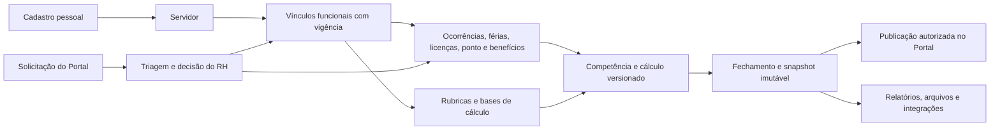

# CeleriFlow — Plano de Implementação de RH e Folha de Pagamento
## Revisão 01 — 19/09/2026

## 1. Finalidade e fontes analisadas

Este plano transforma a POC de Recursos Humanos e Folha de Pagamento em entregas incrementais, testáveis e seguras para o CeleriFlow. Ele foi produzido a partir de:

- [POC de RH e Folha de Pagamento](./CeleriFlow_POC_RH_Folha_de_Pagamento_Desenvolvimento_REV01.md), que organiza os requisitos **RHF-001 a RHF-201** do Termo de Referência;
- [Padrão de tela e tabelas](./PAdrão%20de%20tela%20e%20tabelas.txt), incluído para orientar listas e subpáginas;
- código presente na `main` analisada em 19/09/2026, inclusive os módulos `RH`, `Portal do Servidor`, controle de acesso e componentes ERP compartilhados;
- pedido do usuário: criar/adequar o módulo de RH e Folha, interligá-lo ao Portal do Servidor e manter telas profissionais, densas, sem barra de rolagem no desktop, com **20 itens por página** e paginação.

A POC é uma **fonte de requisitos e rastreabilidade**. As instruções internas dela não substituem o pedido do usuário, a legislação municipal, decisões funcionais da Prefeitura, contratos com terceiros ou homologações oficiais. Em especial, um botão, um arquivo ou uma tela não pode ser chamado de pagamento realizado, transmissão aceita pelo eSocial, perícia concluída ou documento oficial sem a confirmação correspondente.

O objetivo é um núcleo único de dados de RH e Folha. O Portal do Servidor continuará em seu card próprio e será uma visão pessoal, autorizada e limitada desse núcleo; ele não será uma segunda base de cadastro nem concederá acesso administrativo ao RH.

---

## 2. Diagnóstico honesto da `main`

### 2.1 O que já existe e pode ser aproveitado

| Área | Situação encontrada | Aproveitamento no plano |
|---|---|---|
| Entrada do módulo | O card e a rota interna de **RH e Folha** existem. | Manter o card e reorganizar as rotinas por áreas funcionais. |
| Cadastros básicos | Há rotas para servidores, dependentes, benefícios, férias, licenças, ponto, atos e folha. | Preservar os dados válidos e evoluir o modelo com históricos, vigência, validações e auditoria. |
| Escopo de acesso | As rotas de RH usam contexto de tenant e permissão do módulo `RH`. | Estender a matriz de permissões por operação e por dado sensível. |
| Portal do Servidor | Há card, layout próprio e páginas de ficha funcional, documentos, ponto, férias, benefícios e folha. O acesso é derivado do usuário autenticado vinculado ao próprio servidor. | Usar os mesmos registros do RH para leituras autorizadas, sem receber identificador de servidor do navegador. |
| Visibilidade do Portal | A consulta de folha já restringe a exibição a folhas fechadas/pagas; licenças não precisam expor o motivo clínico. | Formalizar publicação por versão, competência e perfil de acesso. |
| Padrão visual inicial | `ModuleShell`, `ErpListFrame` e `ErpTable` começaram a ser aplicados nas listas de RH. | Consolidar um padrão reutilizável para listas, detalhes e formulários. |

### 2.2 Lacunas que impedem considerar o módulo uma folha municipal operacional

| Prioridade | Achado | Efeito | Correção planejada |
|---|---|---|---|
| P0 | A ação de licença grava `description`, enquanto o modelo `Leave` usa `reason`; o formulário também lê o campo inexistente. | Inclusão/alteração pode falhar em tempo de execução e o dado médico fica tratado de modo inconsistente. | Corrigir o mapeamento para `reason`, revisar consumidores e separar campos administrativos de informação médica restrita. |
| P0 | A gestão granular de perfis ainda está em revisão. | Enquanto ela não estiver homologada, negar o Portal por perfil bloquearia o autosserviço. | Durante a demonstração, liberar o card e as rotas do Portal para todo usuário autenticado e ativo; manter a exigência de vínculo funcional ativo e a consulta limitada ao próprio `employeeId`. Reintroduzir a matriz granular quando a gestão de perfis for revisada. |
| P0 | Listas recentes do RH ainda usam consultas sem paginação uniforme ou limites de 50/100; o shell fixo não inclui `/rh`; há contêineres `overflow-auto`. | A tela não atende 20 itens por página nem a regra de não haver rolagem desktop. | Aplicar paginação no servidor, shell de altura fixa e o padrão visual definido neste plano. |
| P0 | O painel de RH aponta para `/rh/cargos` e `/rh/treinamentos`, rotas que não existem, e chama a folha de “holerites”. | Navegação quebrada e comunicação que sugere documento oficial não implementado. | Corrigir destinos, rotular a saída atual como demonstrativo enquanto não houver publicação oficial e exibir somente indicadores verificáveis. |
| P1 | Cadastro de empregado é básico e não representa vínculo funcional, carreira, regime, referência, lotação, banco e alterações de forma histórica. | Alterações podem reescrever o passado e inviabilizam cálculo e rastreabilidade. | Criar entidades efetivas por vigência e ficha funcional consolidada. |
| P1 | Férias, licenças, ponto, benefícios e atos são CRUDs básicos. | Não há saldo, regras de aquisição, prorrogação, apuração, aprovação ou efeitos de folha auditáveis. | Implementar fluxos e estados próprios, antes de vinculá-los a cálculo. |
| P1 | A folha atual calcula uma simulação simples, usa valores `Float`, apaga itens prévios e fecha a folha sem versões, rubricas, incidências ou snapshot protegido. | Não é seguro usá-la como folha legal, demonstrativo oficial, remessa ou base de eSocial. | Substituir por motor versionado e aritmética decimal, com cálculo separado de fechamento, publicação, remessa e pagamento. |
| P1 | A “importação CSV” de ponto é uma interação simulada. | Não há importação, rejeição, conciliação ou evidência de origem. | Criar estágio de importação, mapeamento, validação e trilha de rejeições. |
| P2 | Não foram encontradas integrações configuradas com REP, bancos, consignatárias, benefícios, contabilidade, arquivos oficiais ou eSocial. | Resultados dependentes de contraparte não podem ser declarados como integrados. | Implementar adaptadores somente depois de contrato, leiaute, credencial e homologação. |

### 2.3 Conclusão de escopo atual

O CeleriFlow possui um **alicerce de navegação e CRUD de RH** e já tem uma primeira conexão de consulta do Portal aos mesmos dados. Ainda não há um motor de folha municipal versionado e homologado. Portanto, a primeira entrega deve corrigir a integridade e a segurança, estruturar os dados funcionais e tornar a interface operacional; o cálculo oficial, arquivos, integrações e eSocial entram nas fases próprias abaixo.

---

## 3. Arquitetura-alvo

### 3.1 Um dado-fonte, vários usos autorizados

A pessoa e sua identidade podem ser comuns. Vínculo, cargo, lotação, regime, período de vigência, finalidade, competência e permissão não podem ser confundidos. Toda consulta do Portal será limitada ao `employeeId` derivado do usuário autenticado e do tenant corrente.

Durante a demonstração, o acesso ao **Portal do Servidor** fica disponível a todos os perfis autenticados e ativos. Isso não abre o RH administrativo, não elimina a ativação global do módulo e não permite que alguém sem vínculo funcional leia dados de servidor. A matriz granular voltará a ser aplicada ao final da revisão de perfis.

### 3.2 Princípios obrigatórios do domínio

1. **Vigência e histórico.** Alterações de cargo, referência, salário, lotação, regime, banco, dependente, benefício ou evento devem criar versão efetiva, nunca sobrescrever uma competência já fechada.
2. **Precisão monetária.** Bases, proventos, descontos, encargos e totais usarão decimal/inteiro monetário, com regra de arredondamento explícita; `Float` não será a base do motor de cálculo.
3. **Estados distintos.** Calcular, validar, fechar, publicar demonstrativo, gerar arquivo, remeter, receber retorno e pagar são estados e evidências separados.
4. **Rastreabilidade.** Cada resultado terá origem, regra/versionamento, operador, data, competência e efeitos relacionados. Itens fechados e comprovantes não serão apagados por reprocessamento.
5. **Segurança por dado.** Dados de saúde, CID, atestado, perícia, conta bancária, pensão e documentos pessoais terão acesso por finalidade, perfil e operação, além de auditoria.
6. **Integração por contrato.** Importadores e exportadores terão versão de leiaute, lote, total, rejeições, idempotência e recibo/retorno quando houver contraparte.
7. **Sem dupla base.** Portal, RH, Processos e demais módulos referenciam identificadores e versões do núcleo, sem copiar cadastro funcional ou documento como fonte paralela.

### 3.3 Parametrização persistida aprovada para a demonstração

As regras demonstrativas do módulo passam a ser registradas em tabelas versionadas no **Neon**, vinculadas à instância municipal: conjunto de regras e vigência, regras tipadas, rubricas e incidências, regimes e faixas previdenciárias, políticas de férias, política de cálculo e regimes de vínculo. Cada alteração guarda evidência de antes/depois em log append-only, sem registrar dados pessoais, clínicos ou financeiros de servidores.

A migration `20260919210000_add_rh_payroll_configuration` deve ser aplicada ao Neon por operação controlada com `prisma migrate deploy`, depois de conferir o histórico já existente no banco. O build da Vercel não executa migrations por padrão; a variável `APPLY_PRISMA_MIGRATIONS=true` é uma opção explícita para uma publicação planejada, com `DATABASE_URL` disponível e histórico conciliado.

O conjunto inicial é identificado como **DEMONSTRAÇÃO** e não substitui estatuto, plano de cargos, tabela previdenciária, convênio de consignação, eSocial ou homologação. Rubricas novas também não alimentam o motor de folha legado; essa ligação ocorrerá somente quando a competência versionada puder congelar uma cópia auditável das regras.

O Portal do Servidor continua a consultar apenas a própria ficha e demonstrativos fechados/pagos. A regra configurável `PORTAL_DEMONSTRATIVOS_HABILITADOS` controla essa visualização, sem liberar rascunhos. O futuro Portal da Transparência receberá somente projeções agregadas e publicáveis, com filtros de anonimização e aprovação; ele não acessará cadastro funcional, documentos, conta bancária, CID, afastamentos ou demonstrativos individuais.

---

## 4. Padrão de interface profissional

O bloco de notas orienta uma página com cabeçalho enxuto, cartão ocupando a área restante, filtros compactos, cabeçalho de tabela e rodapé de paginação. Para atender o pedido posterior do usuário, este plano aplica a seguinte interpretação no desktop:

- área de trabalho fixa entre cabeçalho e rodapé do CeleriFlow, sem rolagem global;
- título compacto, ações principais à direita e filtros em uma única faixa, com filtros avançados recolhíveis;
- cartão branco com borda discreta, contraste de estados e ações por ícone com rótulo/`tooltip` acessível;
- **20 registros por página, sempre buscados no servidor** por `skip/take`, filtros, ordenação estável e total real;
- contador (“1–20 de 83”) e paginação fixa no rodapé da lista;
- linhas compactas, em torno de 25–28 px em alturas menores, células truncadas com título acessível, colunas de menor prioridade ocultadas antes de reduzir a legibilidade;
- cabeçalho e rodapé do cartão fixos; não haverá barras de rolagem horizontais ou verticais nas tabelas de desktop;
- se a altura física não permitir 20 linhas legíveis, a rota entra no modo responsivo de cartões/colunas prioritárias, ainda sem rolagem de página; esse limite é necessário para não sacrificar acessibilidade em telas muito baixas;
- formulários e detalhes usam subpáginas com cabeçalho, navegação de retorno, seções em cartões e abas por domínio. O formulário não será uma tabela espremida.

O verde institucional do CeleriFlow continua como cor de ação primária. Âmbar fica reservado a atenção/pendência; violeta não deve se tornar a cor dominante do módulo.

### Componentes compartilhados a concluir

| Componente | Ajuste necessário |
|---|---|
| `ClientLayout` | Incluir as rotas `/rh` no espaço de trabalho ERP fixo. |
| `ModuleShell` | Navegação de RH por grupos: Cadastros, Movimentações, Jornada, Folha, Documentos e Relatórios. |
| `ErpListFrame` | Remover rolagem de desktop e reservar área para 20 linhas e paginação fixa. |
| `ErpTable` | Densidade responsiva, largura de colunas definida, ordem acessível, células truncadas e menu de ações. |
| `ErpPagination` | Componente único com total, página, anterior/próxima e preservação de filtros/ordem na URL. |
| Formulários de RH | Cabeçalho de registro, abas, status, histórico, ações de salvar/cancelar e validações no servidor. |

---

## 5. Fases de implementação

### Fase 0 — Integridade, acesso e operação visual

**Objetivo:** corrigir o que hoje pode quebrar a operação e estabelecer o padrão que será usado nas próximas entregas.

1. Corrigir `Leave.reason`/`description`, rever todos os consumidores e remover a indicação de que CID deve ser informado em um campo genérico visível a todos.
2. Corrigir a autorização de `PORTAL_SERVIDOR` na persistência de perfis e cobrir perfil restritivo, administrador e usuário sem vínculo.
3. Inserir `/rh` no shell ERP fixo e aplicar o padrão de 20 itens por página às listas existentes: servidores, dependentes, férias, licenças, benefícios, ponto, atos e folhas.
4. Padronizar filtro, ordenação estável, estado vazio, total, paginação e ação de detalhe/edição.
5. Corrigir links inexistentes e textos que sugerem holerite, cálculo oficial ou evento recente sem fonte verificável.
6. Criar uma matriz de permissões de RH por operação: consulta, manutenção, aprovação, fechamento, publicação, arquivos e saúde ocupacional.

**Critério de aceite:** nenhuma rota de RH quebra por campos incompatíveis; uma lista com 21 registros mostra exatamente 20, muda de página sem perder filtro, cabe em um notebook sem barra de rolagem e respeita tenant/perfil.

### Fase 1 — Cadastro funcional, organização e auditoria

**Objetivo:** criar a fonte confiável que sustenta todos os cálculos e o Portal.

1. Separar pessoa/servidor, vínculo funcional, cargo, carreira, regime, referência salarial, lotação, secretaria, centro de custo, jornada e dados bancários com início/fim de vigência.
2. Construir ficha funcional por abas: identificação, vínculos, lotações, carreira/remuneração, dependentes, documentos, ocorrências, benefícios, férias/licenças e histórico/auditoria.
3. Implementar validações de CPF/PIS, busca por nome/CPF/RG, recontratação, desligamento, transferências e compatibilidades de admissão sem apagar histórico.
4. Modelar dependente por finalidade, elegibilidade e vigência; modelar pensão judicial, estagiário, bolsista, autônomo e cedência separadamente do servidor efetivo.
5. Implementar catálogo de cargos, referências, carreiras, qualificações, treinamentos, instituições conveniadas e avaliação, substituindo atalhos para rotas inexistentes.
6. Vincular documentos ao armazenamento já configurado por metadados, classificação, hash, versão e autorização; não considerar uma URL solta como GED auditável.
7. Registrar inclusão, alteração, exclusão lógica, aprovação e publicação em trilha de auditoria.

**RHF predominantes:** 001–041.

**Critério de aceite:** uma alteração de referência, lotação ou vínculo gera nova vigência; a ficha mostra passado e presente; o Portal lê somente os campos liberados da ficha do próprio servidor.

### Fase 2 — Movimentações, jornada e atos

**Objetivo:** transformar os CRUDs de férias, licenças, ponto e benefícios em processos com regra, saldo e efeito rastreável.

1. **Férias:** períodos aquisitivos, saldo, fracionamento, terço, adiantamento de 13º, gozo coletivo, planejamento anual e eventos de pagamento derivados do período aprovado.
2. **Licenças e saúde:** tipos configuráveis, estado de solicitação/análise/deferimento/encerramento, prorrogação, retorno, bloqueios de sobreposição e contagem. CID, atestado, médico/CRM, perícia e CAT ficam em área de saúde ocupacional com acesso segregado.
3. **Atos:** modelos versionados, geração a partir de evento aprovado, assinatura/publicação conforme integração definida, referência cruzada ao vínculo e ao processo administrativo quando aplicável.
4. **Vale-transporte e benefícios:** fornecedores, roteiros/quantidade, elegibilidade, mapa de compra/entrega, reduções por frequência/férias/licenças e rubricas geradas a partir de regra validada.
5. **Tempo de serviço:** contadores separados para adicional, férias, progressão e certidão; eventos de suspensão e averbação com evidência documental.
6. **Ponto eletrônico:** escala, regra de apuração/tolerância, banco de horas, faltas/inconsistências e importação por estágio. A importação deve registrar arquivo, leiaute, origem, linhas aceitas/rejeitadas, responsável e possibilidade de conciliação.
7. **Concursos e seletivos:** vagas, comissão, candidatos, notas, cotas/vaga especial, títulos, assunção/desistência, sem construir plataforma de prova online fora do escopo.

**RHF predominantes:** 042–106.

**Critério de aceite:** uma ocorrência aprovada produz saldo/efeito explícito, o ponto importa um lote real com rejeições reproduzíveis e atos não são emitidos automaticamente sem regra e aprovação definidas.

### Fase 3 — Motor de folha, competência e fechamento

**Objetivo:** substituir a simulação atual por cálculo reprodutível e auditável antes de gerar qualquer resultado oficial.

1. Criar competência, tipos de folha e grupo de processamento; permitir mais de uma folha na mesma referência sem mistura de públicos ou finalidade.
2. Criar catálogo de rubricas, incidências, bases, prioridades, fórmulas em linguagem controlada, validação, versão e vigência. A fórmula deve ser revisada e protegida após aprovação.
3. Aplicar regras a vínculos elegíveis e importar variáveis com lote/rejeições. Nunca inferir valor de benefício pelo nome do benefício.
4. Tratar férias, rescisão, 13º, salário-família, consignações, pensão judicial, parcelamentos, insuficiência de saldo, INSS de outra empresa, RGPS/RPPS e provisões conforme regras municipais fornecidas e versionadas.
5. Criar ciclo: rascunho → calculada → em conferência → fechada → demonstrativo publicado → remessa gerada → retorno conciliado → pagamento confirmado. Cada transição exige permissão e evidência.
6. Ao fechar, gravar snapshot imutável de vínculo, rubricas, regras, bases, itens e totais. Ajuste posterior cria retificação/folha complementar, nunca apaga a competência fechada.
7. Criar comparativo entre competências, ficha financeira histórica, relatórios de conferência e trilha de divergência antes da publicação ao Portal.

**RHF predominantes:** 107–138.

**Critério de aceite:** um cenário com dados controlados recalcula o mesmo total; folha fechada não é alterada por CRUD posterior; a competência só aparece como demonstrativo no Portal depois de publicação autorizada.

### Fase 4 — Documentos, relatórios e Portal do Servidor

**Objetivo:** fazer o autoatendimento depender de dados fechados/publicados e criar solicitações rastreáveis, sem duplicar o RH.

1. Publicar no Portal somente versões autorizadas de ficha, atos, férias, ponto, benefícios e demonstrativos. A mensagem de disponibilidade identifica competência, data de publicação e status.
2. Criar `Solicitação de Autoatendimento do Servidor` com tipo, dados mínimos, anexos, status, prazo, histórico, responsável RH, decisão e referência ao registro aplicado.
3. Os tipos iniciais recomendados são: atualização de dados pessoais, pedido/acompanhar férias, consulta de ponto com contestação, entrega de documento e solicitação de declaração. Mudança de salário, regime, conta bancária, vínculo ou dado clínico nunca é aplicada diretamente pelo Portal; vira solicitação para análise de RH.
4. Preparar conector opcional com **Processos e Protocolos** para abrir processo interno quando o tipo exigir rito formal. O mapeamento de assunto, sigilo, prazo e unidade destinatária será configurado depois de decisão administrativa; não criar processo automaticamente sem ela.
5. Garantir URLs assinadas e temporárias para documentos no Blob, log de download/publicação e bloqueio de acesso cruzado entre servidores.
6. Entregar documentos, relatórios e arquivos internos com versão, filtro, competência, total e indicação clara se são demonstrativos, prévias ou documentos oficiais.

**RHF predominantes:** 139–180, além do contrato de integração com o Portal do Servidor.

**Critério de aceite:** um servidor autenticado vê somente seus próprios itens publicados, não visualiza CID/motivo clínico nem documento de outro servidor, abre uma solicitação e acompanha o tratamento até o registro de RH correspondente.

### Fase 5 — Arquivos oficiais, integrações externas e eSocial

**Objetivo:** conectar o núcleo validado às contrapartes, com homologação e evidência de cada transmissão.

1. Implementar geradores para arquivos previstos no TR somente após receber leiaute, versão, entidade destinatária e conjunto de homologação.
2. Implementar adaptadores independentes para banco, consignatária, REP, fornecedor de benefício, contabilidade, Tribunal de Contas e outras contrapartes. Cada adaptador terá configuração por tenant, credenciais seguras, lote, retry idempotente, retorno e conciliação.
3. Implementar fila eSocial com eventos, versão de schema, certificado, ambiente de homologação/produção, recibo, rejeição, retificação e consulta de situação. XML gerado localmente é estado “preparado”; somente recibo válido da contraparte muda o estado para “aceito”.
4. Preparar rotinas de exportação/relatório mencionadas no TR, como SEFIP/GFIP, DIRF, RAIS, CAGED, MANAD, TCE, SIOPE e atuariais, sem afirmar suporte até concluir teste de leiaute e aceite do destinatário.

**RHF predominantes:** 139–201, com eSocial em 181–201.

**Critério de aceite:** cada lote possui identificador, arquivo/assinatura, totais, retorno, rejeições e evidência de homologação; nenhum status de pagamento ou envio é inferido sem retorno.

### Fase 6 — Migração, paralelismo e entrada em produção

**Objetivo:** migrar dados e ativar cálculo de forma controlada.

1. Levantar fonte atual, qualidade, titularidade e histórico a importar.
2. Importar em área de estágio, validar CPF/PIS, vínculos, datas, duplicidades, saldos e totais antes de promover dados.
3. Executar competência piloto em paralelo à referência aprovada pelo RH, comparar totais por rubrica, vínculo e unidade e registrar divergências.
4. Bloquear alterações estruturais e ativar fechamento/publicação somente depois de aceite formal do RH, Contabilidade e responsável da Prefeitura.
5. Preservar logs, snapshots, documentos e plano de reversão de configuração. Não executar reset de base ou exclusão em massa para migrar.

---

## 6. Matriz de rastreabilidade RHF

| Bloco da POC | IDs | Entrega principal | Fase | Evidência mínima |
|---|---:|---|---:|---|
| Cadastro | 001–041 | Ficha funcional, vínculos históricos, dependentes, cargos, carreiras, documentos e auditoria | 1 | criação/alteração com vigência, consulta histórica e auditoria |
| Férias | 042–048 | Períodos aquisitivos, saldo, fracionamento, planejamento e eventos | 2 | saldo antes/depois e aprovação |
| Medicina, licenças e afastamentos | 049–068 | Processo de afastamento, dados ocupacionais segregados, cedência | 2 | RBAC de saúde, sobreposição e retorno |
| Atos administrativos | 069–078 | Modelos, atos derivados e publicação controlada | 2 | ato versionado e referência de origem |
| Vale-transporte | 079–086 | Elegibilidade, mapa de compra/entrega e rubricas | 2 | cálculo auditável por servidor |
| Contagem de tempo | 087–090 | Contadores por finalidade e certidão | 2 | regras de suspensão/averbação |
| Ponto eletrônico | 091–097 | Escala, apuração, banco de horas e importação | 2 | lote real com aceites/rejeições |
| Concurso público | 098–106 | Concurso, vaga, candidato, classificação e nomeação | 2 | fluxo de candidato até assunção/desistência |
| Folha de pagamento | 107–138 | Rubricas, cálculo, conferência, fechamento, retificação e provisões | 3 | cenário reproduzível e snapshot fechado |
| Geração de arquivos | 139–153 | Arquivos versionados, lote e retorno | 5 | arquivo/recibo ou rejeição documentada |
| Relatórios | 154–180 | Relatórios, fichas, mapas e comparativos | 4 e 5 | filtro, competência, total e fonte |
| eSocial | 181–201 | Eventos, certificados, transmissão e retorno | 5 | lote homologado, recibo/rejeição |

A matriz não presume que todos os IDs sejam telas independentes. Cada requisito terá, no backlog de execução, link para modelo/serviço, caso de teste, massa de dados e evidência.

---

## 7. Contrato de integração com o Portal do Servidor

### Leitura atual que será preservada

O Portal deve continuar consumindo a mesma base de:

- identificação e ficha funcional do servidor;
- atos pessoais publicados;
- registros de ponto;
- férias e afastamentos em nível administrativo permitido;
- benefícios vinculados;
- itens de folha de competências fechadas/publicadas.

A associação é feita pelo servidor do usuário autenticado, não por um parâmetro de URL. O Portal não deve mostrar CID, motivo de licença, laudo, anexo médico, dados de outro servidor, cálculo em rascunho ou evento que ainda não foi publicado pelo RH.

### Evolução proposta

| Necessidade do Portal | Fonte RH | Regra de publicação | Fluxo de retorno ao RH |
|---|---|---|---|
| Ficha funcional | vínculo e atributos liberados | versão vigente, sem dados bancários/sensíveis | pedido de correção de dado pessoal |
| Férias | período, saldo e agenda | dados aprovados/publicados | solicitação de programação ou ajuste, submetida à análise |
| Ponto | espelho e inconsistências permitidas | competência apurada | contestação com justificativa e anexo |
| Benefícios | elegibilidade e histórico | benefício vigente/publicado | solicitação de adesão/alteração conforme regra |
| Folha | snapshot de competência | somente demonstrativo publicado após fechamento | consulta; retificação é decisão de RH |
| Documentos/atos | documento classificado e liberado | versão, sigilo e URL temporária | solicitação de documento/declaração |

O novo fluxo de solicitações terá estado `rascunho`, `enviada`, `em análise`, `aguardando complemento`, `deferida`, `indeferida`, `aplicada` ou `cancelada`, além de histórico e auditoria. A transição para `aplicada` exige que o RH tenha efetuado ou vinculado a movimentação válida no núcleo. Quando a regra municipal exigir protocolo, a solicitação poderá criar ou referenciar um processo interno, mediante configuração da Prefeitura.

---

## 8. Segurança, LGPD e documentos

1. Registrar finalidade, perfil, operação e data de acesso aos dados pessoais sensíveis.
2. Separar permissões de RH geral, Folha, Saúde/Ocupacional, gestor aprovador, auditoria e Portal do Servidor.
3. Não expor CID, razão clínica, laudos, atestados ou histórico médico fora da área autorizada. Dados necessários para efeitos administrativos serão minimizados no Portal e nos relatórios gerais.
4. Manter documentos no Blob por metadados, classificação, retenção, versão, hash e URL temporária. O Blob é armazenamento; não substitui controle de acesso, auditoria ou assinatura.
5. Tratar credenciais de integrações em cofre/configuração segura, nunca em código, formulário aberto ou log.
6. Definir com a Prefeitura a base legal, responsáveis, prazo de retenção, política de descarte e canal de atendimento aos titulares. O sistema deve permitir execução e evidência da política aprovada, sem inventá-la.

Mensagem padrão para áreas de consulta restrita:

> **Dados pessoais protegidos:** utilize estas informações somente para a finalidade administrativa autorizada. O acesso é registrado e o compartilhamento indevido é vedado. Dados de saúde e documentos sensíveis possuem acesso restrito.

---

## 9. Dependências externas e decisões necessárias

### 9.1 Decisões funcionais da Prefeitura

| Decisão | Necessária antes de | Responsável sugerido |
|---|---|---|
| Regimes jurídicos, estatuto, plano de cargos, carreiras, tabelas de referência e vigências | Fases 1 e 3 | RH e Jurídico |
| Calendário de competências, datas de corte, tipos de folha e responsáveis por cada aprovação | Fase 3 | RH e Contabilidade |
| Regras de férias, licença-prêmio, afastamentos, retorno, maternidade, adicionais e contagem de tempo | Fase 2 | RH e Jurídico |
| Política de acesso a CID, laudos, CAT, perícia e medicina ocupacional | Fase 2 | Saúde ocupacional, RH e DPO/Encarregado |
| Rubricas, incidências, prioridades, RGPS/RPPS, pensão, consignações, margem, teto e arredondamentos | Fase 3 | RH, Contabilidade e Jurídico |
| Conceito e emissor do resultado RHF-136, documentos que serão oficiais e assinatura necessária | Fases 3 e 4 | RH e Secretaria competente |
| Tipos de solicitação do Portal, prazos, aprovadores e quais exigem Processo/Protocolo | Fase 4 | RH, Ouvidoria/Processos e Secretaria competente |
| Fontes e qualidade dos dados legados a migrar | Fase 6 | RH e TI |

### 9.2 Dependências de terceiros

| Dependência | Informação/artefato necessário | Fase |
|---|---|---:|
| REP/relógio de ponto | fabricante, modelo, leiaute de exportação, regras de apuração e arquivo de homologação | 2/5 |
| Banco | convênio, layout de remessa/retorno, ambiente de teste, credenciais e responsável | 5 |
| Consignatárias | contrato, margem, layout, regras de rejeição e conciliação | 3/5 |
| Benefícios/vale-transporte | fornecedores, catálogo, layout e política de elegibilidade | 2/5 |
| Contabilidade/Tesouraria | plano de contas, eventos, layout, competência e critérios de conciliação | 3/5 |
| Tribunal/arquivos oficiais | destinatário, versão válida do leiaute, ambiente e amostra homologada | 5 |
| eSocial | certificado, procuração, versão de schema, ambiente de homologação e responsável legal | 5 |
| Assinatura e publicação | provedor, certificado, política de assinatura e publicação | 2/4 |

Sem esses contratos, o CeleriFlow pode manter o dado e preparar uma prévia, mas não deve marcar a operação como integrada, transmitida, paga ou aceita.

---

## 10. Estratégia de testes e evidências

### Testes técnicos

- migration incremental validada em base de teste, sem reset destrutivo;
- testes unitários para CPF/PIS, sobreposição de vigência, saldos, fórmulas, arredondamentos, prioridades e transições de estado;
- testes de integração para tenant, perfil, histórico, idempotência de lote, snapshot fechado e publicação;
- testes de autorização negativos: outro servidor, usuário sem vínculo funcional, perfil sem saúde e documento sem liberação; teste positivo temporário para perfil autenticado sem permissão granular de Portal, sempre limitado ao próprio vínculo;
- build, lint e verificações de rotas antes de cada commit.

### Testes de interface

- lista com 0, 1, 20, 21 e mais de 40 registros, com filtro e ordenação persistidos;
- notebook e desktop sem barra de rolagem global/tabela, com cabeçalho, rodapé e paginação visíveis;
- telas de altura reduzida em modo responsivo de cartões, sem ocultar ações críticas;
- subpágina de servidor com histórico, status e retorno à lista preservando filtros;
- navegação por teclado, rótulos, foco, contraste e mensagens de erro úteis.

### Cenários funcionais de aceite

1. Admitir servidor, criar vínculo, lotação e referência; alterar cargo em data futura; consultar as duas versões.
2. Registrar férias, aprovar fracionamento e validar saldo e efeito de competência.
3. Registrar licença sem expor CID ao Portal; validar que o perfil de saúde autorizado pode acessar a evidência necessária.
4. Importar ponto com linha inválida, conferir rejeição e corrigir sem duplicar as linhas aceitas.
5. Calcular competência piloto, fechar snapshot, publicar demonstrativo e confirmar que alteração posterior de cadastro não modifica o resultado publicado.
6. Abrir solicitação pelo Portal, tratar no RH, aplicar decisão e confirmar histórico nas duas áreas.
7. Gerar lote de integração em homologação e armazenar retorno/rejeição antes de qualquer status final.

A cada fase, os cenários devem ser vinculados aos IDs RHF cobertos, com massa de dados sintética ou anonimizada e evidência reproduzível.

---

## 11. Ordem recomendada de execução

1. **Fase 0**, incluindo correções P0 e padrão de 20 linhas/paginação.
2. **Fase 1**, para estabelecer fonte histórica e permissões antes de novos cálculos.
3. **Fase 2**, para gerar movimentos confiáveis de férias, licença, ponto e benefícios.
4. **Fase 3**, com piloto controlado de folha e regras municipais recebidas.
5. **Fase 4**, com publicação/snapshot no Portal e solicitações rastreáveis.
6. **Fase 5**, após contratos e homologação das contrapartes externas.
7. **Fase 6**, com paralelismo, aceite e entrada em produção.

A sequência evita repetir o problema de criar telas bonitas sobre uma base que ainda não preserva histórico ou de publicar no Portal um cálculo que não passou por fechamento. Ela também permite entregar valor visual e operacional já na Fase 0, sem afirmar que as obrigações reguladas posteriores estão concluídas.
